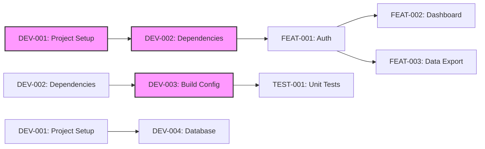
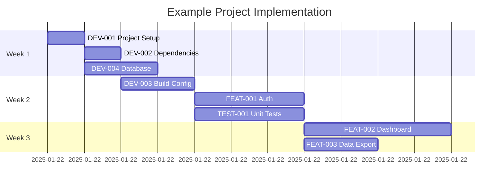

# Task Tracker - Example Project

## Executive Summary

This tracker manages the implementation of a sample project using the generic task management system. It demonstrates how tasks are organized by category, tracked through phases, and managed with dependencies.

## Current Status Overview

### Phase Progress

| Phase                | Completion | Status     |
| -------------------- | ---------- | ---------- |
| Development Setup    | 0%         | 🔄 Active  |
| Core Features        | 0%         | ⏸️ Planned |
| Testing & Validation | 0%         | ⏸️ Planned |

### Quick Metrics

- **Critical Path Duration**: ~6 hours (DEV tasks)
- **Total Effort Required**: ~12 hours
- **Target Completion**: February 2025
- **Blockers**: None currently

## Phase 1: Development Setup Tasks

### Critical Path (P0)

| Task ID                                                | Title                        | Priority | Duration | Dependencies | Status   |
| ------------------------------------------------------ | ---------------------------- | -------- | -------- | ------------ | -------- |
| [DEV-001](development/DEV-001-setup-project.md)        | Initialize Project Structure | P0       | 1h       | None         | 🔄 Ready |
| [DEV-002](development/DEV-002-install-dependencies.md) | Install Core Dependencies    | P0       | 1h       | DEV-001      | 🔄 Ready |
| [DEV-003](development/DEV-003-configure-build.md)      | Configure Build System       | P0       | 2h       | DEV-002      | 🔄 Ready |
| [DEV-004](development/DEV-004-setup-database.md)       | Setup Database Schema        | P0       | 2h       | DEV-001      | 🔄 Ready |

### Important Features (P1)

| Task ID                                              | Title                         | Priority | Duration | Dependencies | Status     |
| ---------------------------------------------------- | ----------------------------- | -------- | -------- | ------------ | ---------- |
| [FEAT-001](features/FEAT-001-user-authentication.md) | Implement User Authentication | P1       | 3h       | DEV-003      | ⏸️ Blocked |
| [TEST-001](testing/TEST-001-unit-tests.md)           | Add Unit Test Framework       | P1       | 3h       | DEV-003      | ⏸️ Blocked |

**Phase 1 Total**: ~6 hours

## Phase 2: Core Features Tasks

| Task ID                                         | Title                   | Priority | Duration | Dependencies | Status     |
| ----------------------------------------------- | ----------------------- | -------- | -------- | ------------ | ---------- |
| [FEAT-002](features/FEAT-002-user-dashboard.md) | Create User Dashboard   | P1       | 4h       | FEAT-001     | ⏸️ Blocked |
| [FEAT-003](features/FEAT-003-data-export.md)    | Add Data Export Feature | P1       | 2h       | FEAT-001     | ⏸️ Blocked |

**Phase 2 Total**: ~6 hours

## Task Dependencies



## Execution Timeline



## Critical Path

The minimum time to completion follows this sequence:

1. **Foundation Setup** (Week 1):

   - DEV-001: Initialize project structure
   - DEV-002: Install dependencies
   - DEV-004: Setup database schema

2. **Build Configuration** (Week 2):

   - DEV-003: Configure build system
   - FEAT-001: Implement user authentication

3. **Feature Development** (Week 3):
   - FEAT-002: Create user dashboard
   - FEAT-003: Add data export

**Critical Path Duration**: ~6 hours for core functionality

## Risk Register

| Risk                       | Probability | Impact | Mitigation                      |
| -------------------------- | ----------- | ------ | ------------------------------- |
| Dependency conflicts       | Medium      | High   | Use dependency management tools |
| Build configuration issues | Low         | Medium | Test build process early        |
| Database setup complexity  | Low         | Low    | Use migration scripts           |

## Success Criteria

- [ ] **Project Setup Complete**: All development tools and dependencies installed
- [ ] **Build System Working**: Code builds and tests pass successfully
- [ ] **User Authentication**: Users can register and login to the system
- [ ] **Core Features**: Dashboard and data export functionality implemented
- [ ] **Test Coverage**: Unit tests cover core functionality

## Quick Commands

### Development Workflow

```bash
# Update these commands for your specific tech stack
# Example for web apps:
cd [project-directory]
npm run dev          # Start development server
npm run build        # Build for production
npm run test         # Run test suite
npm run lint         # Check code quality

# Example for databases:
psql -f schema.sql   # Apply database schema
dbt build           # Build data models
sqlfluff lint       # Check SQL quality
```

## Notes

- Tasks marked 🔄 Ready can be started immediately
- Update task status immediately when starting/completing work
- Update this INDEX.md when adding/removing tasks
- Archive completed phases to `completed/` subdirectory

## References

- [Project Documentation](../../README.md)
- [Architecture Decisions](../../decisions/)
- [Technical Guides](../../docs/)
- [API Documentation](../../api/)

---

_Use [README.md](README.md) for task system documentation_
_Individual task details in respective task files_
