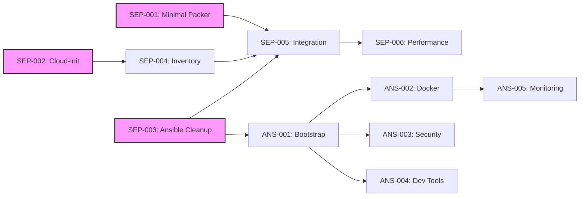
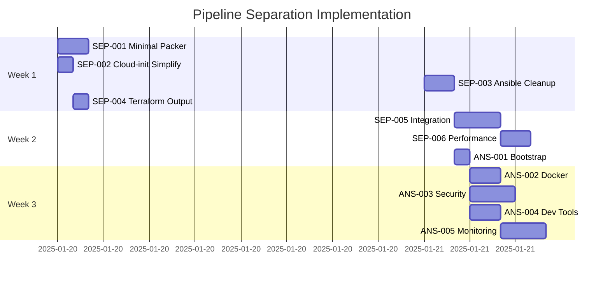

# Task Tracker - Pipeline Separation Project

## Executive Summary

This tracker manages the implementation of complete pipeline separation for the Sombrero-Edge-Control infrastructure, decoupling Packer, Terraform, and Ansible into independent, testable components. The refactor addresses tool coupling, duplicate code, and testing challenges identified in [ADR-20250118](../../decisions/20250118-pipeline-separation.md).

## Current Status Overview

### Phase Progress

| Phase | Completion | Status |
|-------|------------|--------|
| Pipeline Separation | 17% | 🚧 Active |
| Ansible Configuration | 0% | ⏸️ Planned |
| Integration & Testing | 0% | ⏸️ Planned |

### Quick Metrics

- **Critical Path Duration**: ~11 hours (SEP tasks)
- **Total Effort Required**: ~22 hours
- **Target Completion**: February 2025
- **Blockers**: None currently

## Phase 1: Pipeline Separation Tasks

### Critical Path (P0)

| Task ID | Title | Priority | Duration | Dependencies | Status |
|---------|-------|----------|----------|--------------|--------|
| [SEP-001](pipeline-separation/SEP-001-minimal-packer-template.md) | Create Minimal Packer Template | P0 | 2h | None | ✅ Complete |
| [SEP-002](pipeline-separation/SEP-002-simplify-cloud-init.md) | Simplify Cloud-init to SSH Only | P0 | 1h | None | 🔄 Ready |
| [SEP-003](pipeline-separation/SEP-003-ansible-collection-cleanup.md) | Ansible Collection Cleanup | P0 | 2h | None | 🔄 Ready |
| [SEP-004](pipeline-separation/SEP-004-terraform-inventory-output.md) | Terraform Inventory Output | P0 | 1h | SEP-002 | ⏸️ Blocked |
| [SEP-005](pipeline-separation/SEP-005-pipeline-integration.md) | Pipeline Integration & Handoffs | P0 | 3h | SEP-001,002,003,004 | ⏸️ Blocked |

### Optimization (P2)

| Task ID | Title | Priority | Duration | Dependencies | Status |
|---------|-------|----------|----------|--------------|--------|
| [SEP-006](pipeline-separation/SEP-006-performance-validation.md) | Performance Validation | P2 | 2h | SEP-005 | ⏸️ Blocked |

**Phase 1 Total**: ~11 hours

## Phase 2: Ansible Configuration Tasks

| Task ID | Title | Priority | Duration | Dependencies | Status |
|---------|-------|----------|----------|--------------|--------|
| [ANS-001](ansible-configuration/ANS-001-bootstrap-playbook.md) | Bootstrap Playbook | P1 | 1h | SEP-003 | ⏸️ Blocked |
| [ANS-002](ansible-configuration/ANS-002-docker-installation.md) | Docker Installation Role | P1 | 2h | ANS-001 | ⏸️ Blocked |
| [ANS-003](ansible-configuration/ANS-003-security-hardening.md) | Security Hardening | P1 | 3h | ANS-001 | ⏸️ Blocked |
| [ANS-004](ansible-configuration/ANS-004-development-tools.md) | Development Tools | P1 | 2h | ANS-001 | ⏸️ Blocked |
| [ANS-005](ansible-configuration/ANS-005-monitoring-stack.md) | Monitoring Stack | P1 | 3h | ANS-002 | ⏸️ Blocked |

**Phase 2 Total**: ~11 hours

## Task Dependencies



## Execution Timeline



## Critical Path

The minimum time to completion follows this sequence:

1. **Parallel Start** (Day 1):
   - SEP-001: Minimal Packer Template
   - SEP-002: Simplify Cloud-init
   - SEP-003: Ansible Collection Cleanup

2. **Integration** (Day 2-3):
   - SEP-004: Terraform Inventory Output
   - SEP-005: Pipeline Integration

3. **Configuration** (Week 2):
   - ANS-001 through ANS-005 in sequence/parallel

**Critical Path Duration**: ~11 hours for core functionality

## Risk Register

| Risk | Probability | Impact | Mitigation |
|------|------------|--------|------------|
| Cloud-init removal breaks provisioning | Medium | High | Test in dev environment first |
| Ansible collection migration issues | Low | Medium | Keep backup of old structure |
| Performance degradation | Low | Low | Benchmark before/after |
| Pipeline handoff failures | Medium | High | Implement validation at each stage |

## Success Criteria

- [ ] **Tool Independence**: Each tool can run without the others
- [ ] **Build Speed**: Packer builds < 7 minutes
- [ ] **Deployment Speed**: End-to-end < 60 seconds
- [ ] **Test Coverage**: All components independently testable
- [ ] **Zero Downtime**: No service interruptions during migration

## Quick Commands

### Current Approach (Before Refactor)

```bash
# Single complex deployment
cd infrastructure/environments/production
terraform apply  # Includes complex cloud-init
```

### Target Approach (After Refactor)

```bash
# Stage 1: Build minimal image
cd packer
packer build ubuntu-minimal.pkr.hcl
# Output: template_id=8024

# Stage 2: Provision infrastructure
cd infrastructure/environments/production
terraform apply -var="template_id=8024"
terraform output -json ansible_inventory > inventory.json

# Stage 3: Configure with Ansible
cd ansible_collections/basher83/automation_server
ansible-playbook -i inventory.json playbooks/site.yml
```

## Notes

- Tasks marked 🔄 Ready can be started immediately
- SEP-001, SEP-002, and SEP-003 can be worked in parallel
- ANS tasks depend on SEP-003 completion
- Performance validation should occur after each major phase

## References

- [Pipeline Separation ADR](../../decisions/20250118-pipeline-separation.md)
- [Refactoring Plan](../../planning/pipeline-separation-refactor.md)
- [Ansible Migration Guide](../../planning/ansible-refactor/collection-structure-migration.md)
- [Current ROADMAP](../../ROADMAP.md)

---

*Use [README.md](README.md) for task system documentation*
*Individual task details in respective task files*
