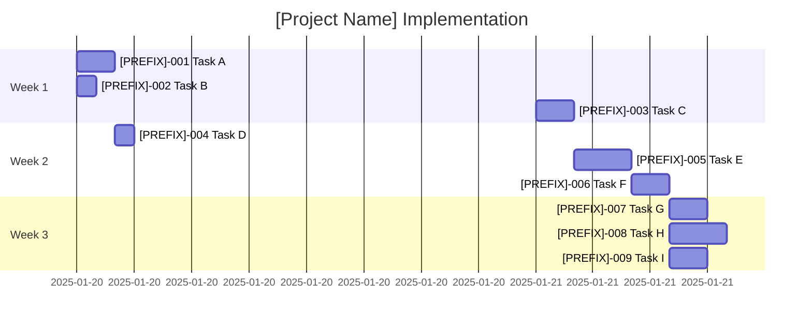

# Task Tracker - [Project Name]

## Executive Summary

This tracker manages the implementation of [brief project description]. The tasks are organized by category and phase, providing clear visibility into progress, dependencies, and the critical path to completion.

## Current Status Overview

### Phase Progress

| Phase          | Completion | Status     |
| -------------- | ---------- | ---------- |
| [Phase 1 Name] | 0%         | ⏸️ Planned |
| [Phase 2 Name] | 0%         | ⏸️ Planned |
| [Phase 3 Name] | 0%         | ⏸️ Planned |

### Quick Metrics

- **Critical Path Duration**: ~X hours ([primary category] tasks)
- **Total Effort Required**: ~X hours
- **Target Completion**: [Target date]
- **Blockers**: [List any current blockers or "None currently"]

## Phase 1: [Phase 1 Name] Tasks

### Critical Path (P0)

| Task ID                                      | Title              | Priority | Duration | Dependencies | Status   |
| -------------------------------------------- | ------------------ | -------- | -------- | ------------ | -------- |
| [[PREFIX]-001]([category]/[PREFIX]-001-*.md) | <Brief task title> | P0       | Xh       | None         | 🔄 Ready |
| [[PREFIX]-002]([category]/[PREFIX]-002-*.md) | <Brief task title> | P0       | Xh       | None         | 🔄 Ready |
| [[PREFIX]-003]([category]/[PREFIX]-003-*.md) | <Brief task title> | P0       | Xh       | None         | 🔄 Ready |

### Important Features (P1)

| Task ID                                      | Title              | Priority | Duration | Dependencies | Status     |
| -------------------------------------------- | ------------------ | -------- | -------- | ------------ | ---------- |
| [[PREFIX]-004]([category]/[PREFIX]-004-*.md) | <Brief task title> | P1       | Xh       | [PREFIX]-001 | ⏸️ Blocked |
| [[PREFIX]-005]([category]/[PREFIX]-005-*.md) | <Brief task title> | P1       | Xh       | [PREFIX]-002 | ⏸️ Blocked |

### Optimization (P2)

| Task ID                                      | Title              | Priority | Duration | Dependencies | Status     |
| -------------------------------------------- | ------------------ | -------- | -------- | ------------ | ---------- |
| [[PREFIX]-006]([category]/[PREFIX]-006-*.md) | <Brief task title> | P2       | Xh       | [PREFIX]-005 | ⏸️ Blocked |

**Phase 1 Total**: ~X hours

## Phase 2: [Phase 2 Name] Tasks

| Task ID                                      | Title              | Priority | Duration | Dependencies | Status     |
| -------------------------------------------- | ------------------ | -------- | -------- | ------------ | ---------- |
| [[PREFIX]-007]([category]/[PREFIX]-007-*.md) | <Brief task title> | P1       | Xh       | [PREFIX]-003 | ⏸️ Blocked |
| [[PREFIX]-008]([category]/[PREFIX]-008-*.md) | <Brief task title> | P1       | Xh       | [PREFIX]-007 | ⏸️ Blocked |
| [[PREFIX]-009]([category]/[PREFIX]-009-*.md) | <Brief task title> | P1       | Xh       | [PREFIX]-007 | ⏸️ Blocked |

**Phase 2 Total**: ~X hours

## Task Dependencies

```mermaid
graph LR
    A[[PREFIX]-001: Task A] --> D[[PREFIX]-005: Task D]
    B[[PREFIX]-002: Task B] --> E[[PREFIX]-004: Task E]
    C[[PREFIX]-003: Task C] --> F[[PREFIX]-007: Task F]
    D --> G[[PREFIX]-006: Task G]
    C --> D
    E --> D

    style A fill:#f9f,stroke:#333,stroke-width:2px
    style B fill:#f9f,stroke:#333,stroke-width:2px
    style C fill:#f9f,stroke:#333,stroke-width:2px
```

## Execution Timeline



## Critical Path

The minimum time to completion follows this sequence:

1. **Foundation Setup** (Week 1):

   - [PREFIX]-001: <Task description>
   - [PREFIX]-002: <Task description>
   - [PREFIX]-003: <Task description>

2. **Core Implementation** (Week 2):

   - [PREFIX]-004: <Task description>
   - [PREFIX]-005: <Task description>

3. **Feature Completion** (Week 3):
   - [PREFIX]-006 through [PREFIX]-009 as needed

**Critical Path Duration**: ~X hours for core functionality

## Risk Register

| Risk               | Probability | Impact | Mitigation            |
| ------------------ | ----------- | ------ | --------------------- |
| <Risk description> | Medium      | High   | <Mitigation strategy> |
| <Risk description> | Low         | Medium | <Mitigation strategy> |
| <Risk description> | Low         | Low    | <Mitigation strategy> |

## Success Criteria

- [ ] **<Success metric 1>**: <Description>
- [ ] **<Success metric 2>**: <Description>
- [ ] **<Success metric 3>**: <Description>
- [ ] **<Success metric 4>**: <Description>
- [ ] **<Success metric 5>**: <Description>

## Quick Commands

### Development Workflow

```bash
# Update these commands for your specific tech stack
# Example for web apps:
cd [project-directory]
npm run dev          # Start development server
npm run build        # Build for production
npm run test         # Run test suite
npm run lint         # Check code quality

# Example for databases:
psql -f schema.sql   # Apply database schema
dbt build           # Build data models
sqlfluff lint       # Check SQL quality
```

## Notes

- Tasks marked 🔄 Ready can be started immediately
- Update task status immediately when starting/completing work
- Update this INDEX.md when adding/removing tasks
- Archive completed phases to `completed/` subdirectory

## References

- [Project Documentation](../../README.md)
- [Architecture Decisions](../../decisions/)
- [Technical Guides](../../docs/)
- [API Documentation](../../api/)

---

_Use [README.md](README.md) for task system documentation_
_Individual task details in respective task files_
